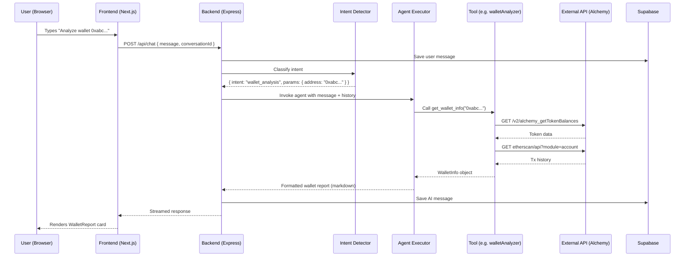
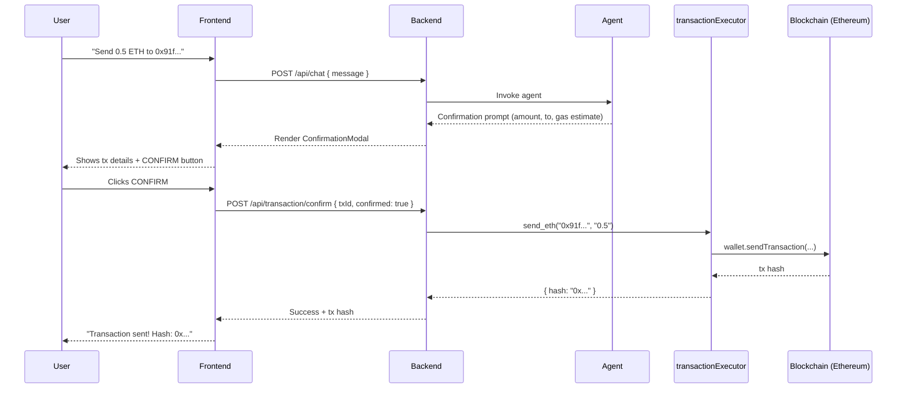

# ChainPilot AI — System Architecture

## High-Level Architecture

```
┌─────────────────────────────────────────────────────────┐
│                    FRONTEND (Next.js)                    │
│  ┌──────────┐  ┌──────────────┐  ┌───────────────────┐  │
│  │ Chat UI  │  │ Wallet Cards │  │ Confirmation Modal│  │
│  └────┬─────┘  └──────┬───────┘  └────────┬──────────┘  │
│       │               │                   │              │
│  ┌────┴───────────────┴───────────────────┴──────────┐  │
│  │              RainbowKit / Wagmi                    │  │
│  │           (Wallet Connection Layer)                │  │
│  └───────────────────────┬───────────────────────────┘  │
└──────────────────────────┼──────────────────────────────┘
                           │ HTTP / WebSocket
┌──────────────────────────┼──────────────────────────────┐
│                  BACKEND (Express.js)                    │
│  ┌───────────────────────┴───────────────────────────┐  │
│  │                  API Routes                       │  │
│  │   /chat  /wallet  /transaction  /token  /defi     │  │
│  └───────────────────────┬───────────────────────────┘  │
│                          │                               │
│  ┌───────────────────────┴───────────────────────────┐  │
│  │              AI AGENT LAYER                       │  │
│  │  ┌─────────────────┐  ┌────────────────────────┐  │  │
│  │  │ Intent Detector │  │ LangChain AgentExecutor│  │  │
│  │  │ (classify input)│  │ (orchestrate tools)    │  │  │
│  │  └────────┬────────┘  └───────────┬────────────┘  │  │
│  │           │                       │               │  │
│  │  ┌────────┴───────────────────────┴────────────┐  │  │
│  │  │              PROMPT LIBRARY                 │  │  │
│  │  │  system · wallet · tx · risk · confirm · …  │  │  │
│  │  └────────────────────────────────────────────┘  │  │
│  └───────────────────────┬───────────────────────────┘  │
│                          │                               │
│  ┌───────────────────────┴───────────────────────────┐  │
│  │                 TOOL SYSTEM                       │  │
│  │  walletAnalyzer  │  transactionExplainer          │  │
│  │  tokenRisk       │  contractExplainer             │  │
│  │  whaleTracker    │  defiAdvisor                   │  │
│  │  ensResolver     │  transactionExecutor           │  │
│  └──┬──────────┬──────────┬──────────┬───────────────┘  │
│     │          │          │          │                    │
└─────┼──────────┼──────────┼──────────┼───────────────────┘
      │          │          │          │
┌─────┼──────────┼──────────┼──────────┼───────────────────┐
│     │   EXTERNAL SERVICES │          │                    │
│  ┌──┴───┐  ┌──┴───┐  ┌──┴───┐  ┌──┴────────┐           │
│  │Alchemy│ │Ether- │ │DeFi  │ │ The Graph  │           │
│  │  RPC  │ │ scan  │ │Llama │ │            │           │
│  └───────┘ └───────┘ └──────┘ └────────────┘           │
│                                                          │
│  ┌──────────┐  ┌──────────┐                              │
│  │ Supabase │  │ OpenAI   │                              │
│  │   (DB)   │  │  (LLM)   │                              │
│  └──────────┘  └──────────┘                              │
└──────────────────────────────────────────────────────────┘
```

---

## Component Descriptions

### 1. Frontend (Next.js)

| Component           | Purpose                                                                 |
|---------------------|-------------------------------------------------------------------------|
| **Chat UI**         | Full-screen chat interface; renders user & AI messages with markdown    |
| **Wallet Cards**    | Structured display for wallet reports, token lists, NFT grids          |
| **Confirmation Modal** | Displays transaction details + gas estimate; CONFIRM / CANCEL       |
| **RainbowKit/Wagmi**| Wallet connection (MetaMask, WalletConnect, Coinbase Wallet)           |
| **Sidebar**         | Conversation history, new chat, settings                                |

### 2. Backend API (Express.js)

| Route                    | Method | Purpose                                       |
|--------------------------|--------|-----------------------------------------------|
| `/api/chat`              | POST   | Send message to agent, receive streamed reply |
| `/api/chat/:id`          | GET    | Fetch conversation history                    |
| `/api/wallet/:address`   | GET    | Direct wallet analysis (bypass chat)          |
| `/api/transaction/:hash` | GET    | Direct tx explanation                         |
| `/api/transaction/confirm` | POST | Confirm & broadcast pending transaction       |
| `/api/token/:address`    | GET    | Direct token risk analysis                    |
| `/api/defi/yields`       | GET    | Current DeFi yield opportunities              |

### 3. AI Agent Layer

| Component              | Purpose                                                                  |
|------------------------|--------------------------------------------------------------------------|
| **Intent Detector**    | Lightweight LLM call; classifies user message into intent category       |
| **Agent Executor**     | LangChain `AgentExecutor`; selects and calls tools based on intent       |
| **Prompt Library**     | 9 specialized prompts for different tasks                                |
| **Memory**             | `BufferWindowMemory` (20 messages) persisted to Supabase `messages`      |

### 4. Tool System

| Tool                    | Data Source            | Read/Write |
|-------------------------|------------------------|------------|
| `walletAnalyzer`        | Alchemy, Etherscan     | Read       |
| `transactionExplainer`  | Alchemy, Etherscan     | Read       |
| `tokenRisk`             | Etherscan, The Graph   | Read       |
| `contractExplainer`     | Etherscan              | Read       |
| `whaleTracker`          | Etherscan              | Read       |
| `defiAdvisor`           | DeFiLlama              | Read       |
| `ensResolver`           | ethers.js provider     | Read       |
| `transactionExecutor`   | ethers.js              | **Write**  |

### 5. External Services

| Service     | Purpose                              | Free Tier Limits                        |
|-------------|--------------------------------------|-----------------------------------------|
| Alchemy     | RPC, token balances, NFTs            | 300M compute units/month                |
| Etherscan   | Tx data, contract source, holders    | 5 calls/sec, 100K calls/day             |
| DeFiLlama   | DeFi yields, TVL                     | Unlimited (public API)                  |
| The Graph   | DEX liquidity, on-chain indexing     | 100K queries/month (free hosted)        |
| OpenAI      | LLM (GPT-3.5/4)                     | Pay-as-you-go (or free trial credits)   |
| Supabase    | Database, auth                       | 500MB DB, 50K monthly active users      |

---

## Data Flow — Chat Request



---

## Data Flow — Transaction Execution



---

## Deployment Architecture (Production)

```
                    ┌──────────────┐
                    │   Vercel     │
                    │  (Frontend)  │
                    └──────┬───────┘
                           │
                    ┌──────┴───────┐
                    │   Railway /  │
                    │   Render     │
                    │  (Backend)   │
                    └──────┬───────┘
                           │
              ┌────────────┼────────────┐
              │            │            │
        ┌─────┴───┐  ┌────┴────┐  ┌───┴──────┐
        │ Supabase│  │ Alchemy │  │ Etherscan│
        │   (DB)  │  │  (RPC)  │  │  (Data)  │
        └─────────┘  └─────────┘  └──────────┘
```

- **Frontend**: Deploy to Vercel (free tier, automatic from GitHub)
- **Backend**: Deploy to Railway or Render (free tier, Docker container)
- **Database**: Supabase hosted (free tier)
